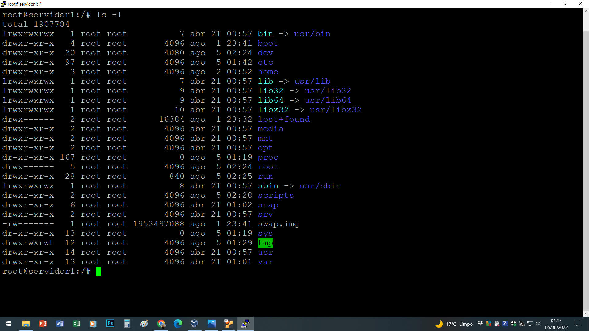
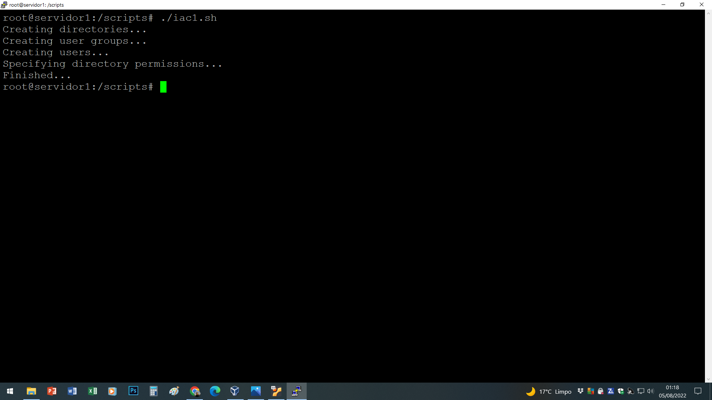
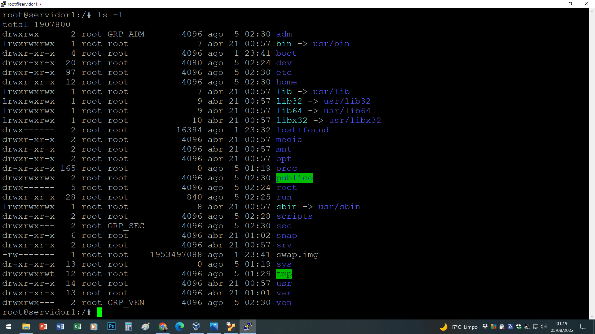

# linux-project1-iac
Infrastructure as Code (IaC): Script for creating the structure of users, directories, and permissions (iac1.sh file) in an Ubuntu Linux environment.

## Available Script

In the project directory, run the next command to apply the changes:

### `./iac1.sh`

## Project Images

<figure>
    <figcaption>Root directory before script execution</figcaption>
    
</figure>

<figure>
    <figcaption>Script execution</figcaption>
    
</figure>

<figure>
    <figcaption>Root directory after script execution</figcaption>
    
</figure>
